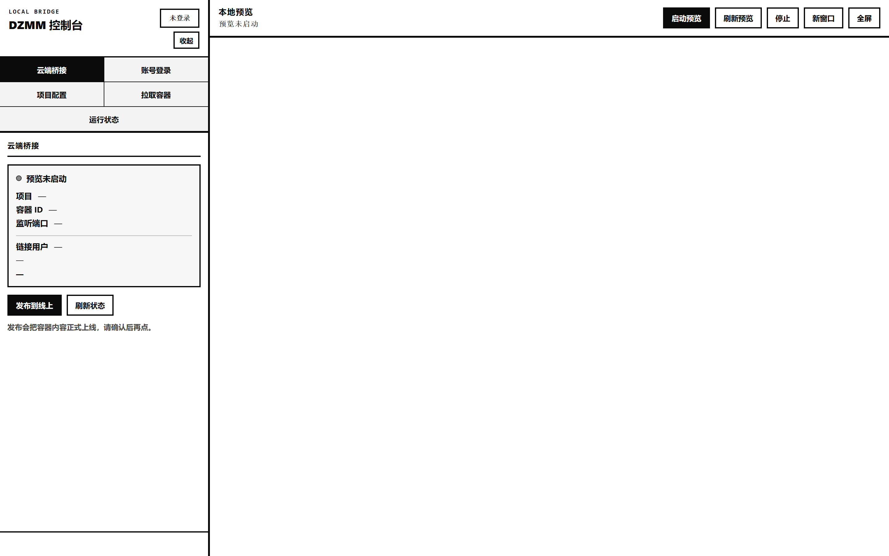
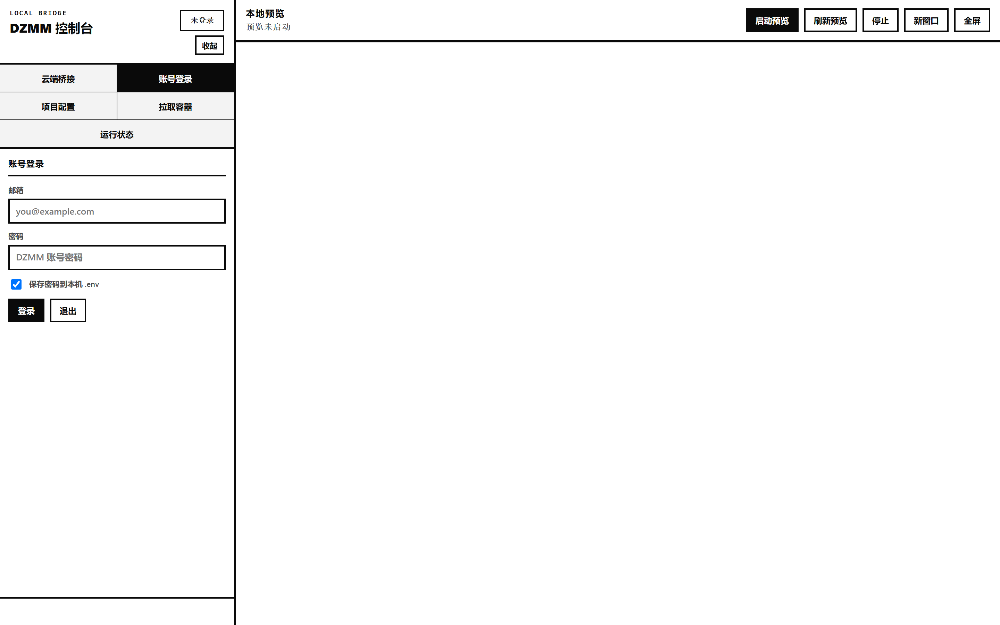
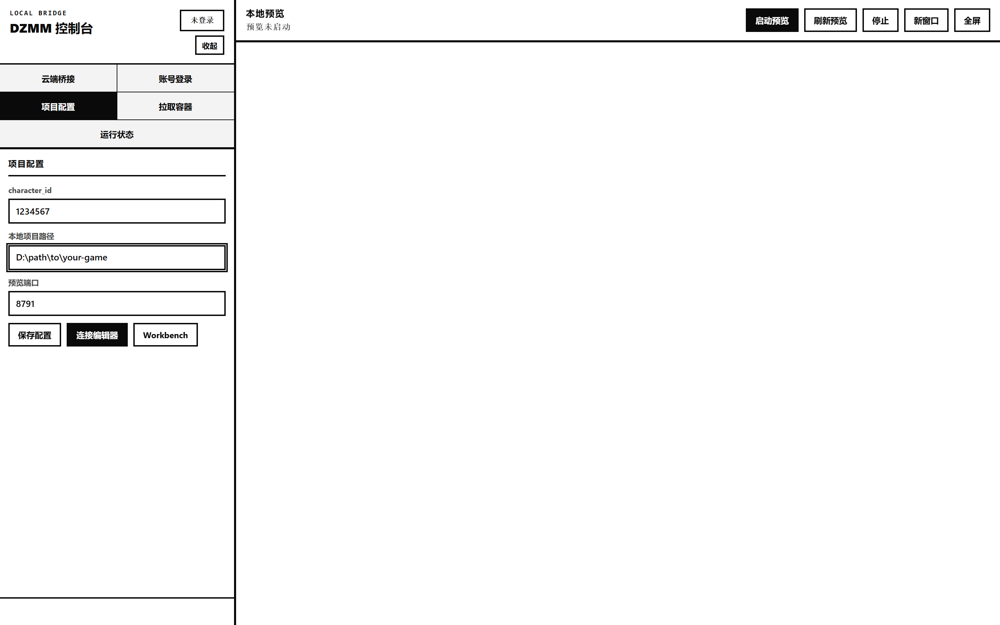
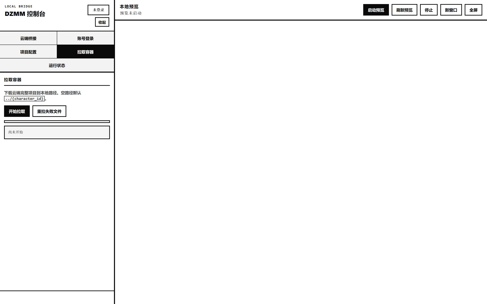
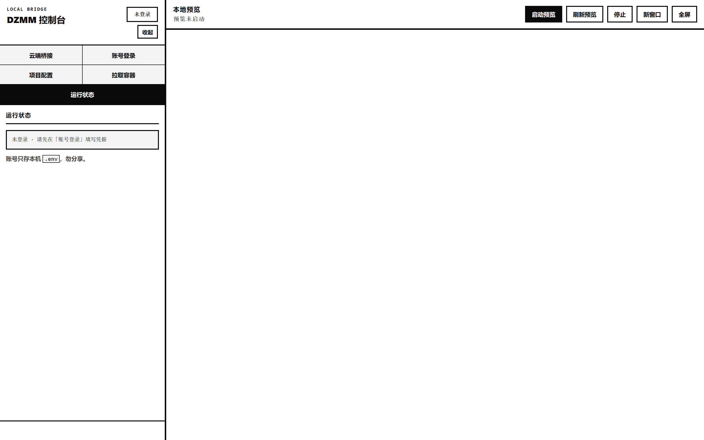

# ⚡ DZMM 本地开发控制台

<p align="center">
  <strong>🌉 Local Bridge · 云端工作室 · 本地预览 · 一键发布</strong>
  <br/><br/>
  <a href="https://discord.gg/da9PMeAGGK"></a>
  <a href="https://github.com/Tomkk74/DZMM-yunduan-"></a>
  
  
</p>

> 💬 **交流群（Discord）** → [https://discord.gg/da9PMeAGGK](https://discord.gg/da9PMeAGGK)  
> 📦 **仓库** → [https://github.com/Tomkk74/DZMM-yunduan-](https://github.com/Tomkk74/DZMM-yunduan-)

独立可分享的 **Local Bridge**：在浏览器里登录 DZMM 账号、绑定 Workbench 角色卡、拉取云端容器到本机，并内嵌启动本地预览。  
适合需要「✏️ 改本地文件 → 👀 预览 → ☁️ 同步 / 🚀 发布」的创作者。

```text
  🖥️  本机改 publish/   ──sync──▶  ☁️  Workbench 容器   ──发布──▶  🌐  线上玩家包
         ▲                              │
         └──────── 拉取整包 ◀───────────┘
```

---

## 🖼️ 界面预览

### 🛰️ 总览 · 云端桥接

左侧功能区 + 右侧大屏预览。未启动预览时中间为空；连接云端并启动预览后，可在此直接看游戏画面。



### 🔐 账号登录

填写 DZMM 邮箱与密码。可勾选「保存密码到本机 `.env`」（默认勾选）。凭据只写在本机，**不会**上传到本仓库。



### ⚙️ 项目配置

三项核心配置：

| 字段 | 说明 |
|:---|:---|
| 🆔 `character_id` | Workbench 地址栏里的角色卡 ID |
| 📁 本地项目路径 | 含 `publish/` 的游戏根目录 |
| 🔌 预览端口 | 默认 `8791`，需端口空闲 |

保存后可点 **连接编辑器** 验证权限，或打开 **Workbench**。



### 📥 拉取容器

把云端容器整包下载到本地路径。路径留空时默认 `../{character_id}`。支持进度条与「重拉失败文件」。



### 📊 运行状态

查看当前登录态、配置与桥接摘要（只读诊断）。



### 🖥️ 全屏预览 · 悬浮球

点 **收起 / 全屏** 后侧栏隐藏，出现圆形 **发布** 键。鼠标移上去时，周围展开三颗卫星键：

| 键 | 作用 |
|:---|:---|
| 📂 菜单 | 展开左侧控制台 |
| 🔄 刷新 | 只刷新中间预览 |
| ☁️ 同步 | **增量**同步：只上传有改动的文件到云端容器 |
| 🚀 发布 | 中心键：拖动改位置；单击正式上线 |

鼠标挪开后，卫星键会缓缓收拢消失。


---

## ✨ 能做什么

| | 能力 | 说明 |
|:---:|:---|:---|
| 🔑 | **登录续期** | 邮箱密码登录，自动维护 cookie / token |
| 🎯 | **绑定项目** | `character_id` + 本地目录 + 预览端口 |
| 📦 | **拉取容器** | 云端 Files 整包落到本地，便于离线改资源 |
| 👀 | **本地预览** | 控制台内嵌 iframe，或新窗口打开 |
| 🚀 | **同步 / 发布** | 改完后 sync 回容器；确认后再「发布到线上」 |

---

## 🚀 快速开始

### ✅ 环境

- 🪟 Windows（附带 `.bat`；其它系统可直接 `python console.py`）
- 🐍 [Python 3](https://www.python.org/)（安装时勾选 *Add to PATH*）
- 🎫 自己的 DZMM 账号，且对该角色卡有 Game Studio 权限

### ▶️ 启动控制台

```bat
git clone https://github.com/Tomkk74/DZMM-yunduan-.git
cd DZMM-yunduan-
start.bat
```

或：

```bat
python console.py --port 8788
```

🌐 浏览器打开：`http://127.0.0.1:8788/`  
（加 `--no-open` 可禁止自动弹窗）

### 🧭 推荐操作顺序

```text
1️⃣  账号登录     →  左上角状态灯亮起
2️⃣  项目配置     →  保存 → 连接编辑器
3️⃣  拉取容器     →  （可选）整包落地
4️⃣  启动预览     →  右侧出画面 / 全屏
5️⃣  改完 sync    →  确认后「发布到线上」
```

1. 🔐 **账号登录** → 登录成功（左上角状态灯变化）  
2. ⚙️ **项目配置** → 填 `character_id`、本地路径、预览端口 → **保存配置** → **连接编辑器**  
3. 📥 （可选）**拉取容器** → **开始拉取**，等进度完成  
4. 👀 **启动预览** → 右侧出现本地游戏；可 **刷新预览 / 新窗口 / 全屏**  
5. ✏️ 本地改 `publish/` 等文件后，用命令行 `sync` 推回容器；确认无误再点 **发布到线上** 🚀  

---

## ⌨️ 命令行（可选）

双击脚本或在仓库根目录执行：

| 脚本 | 作用 |
|:---|:---|
| 🟢 `start.bat` | 打开 Web 控制台 |
| 📡 `status.bat` | 查看当前配置 / 登录态 |
| 📥 `pull.bat` | 拉取容器 |
| ☁️ `sync.bat` | 同步本地到容器 |
| 🖥️ `preview.bat` | 单独起本地预览服务 |

示例：

```bat
python lib\dzmm_studio.py login --email you@mail.com --password "***"
python lib\dzmm_studio.py status --character-id <CHARACTER_ID>
python lib\pull_container.py --character-id <CHARACTER_ID>
python lib\dzmm_studio.py sync --character-id <CHARACTER_ID> --message "sync"
# 默认增量（对照 _sync_meta.json）；强制全量加 --full
```

拉取/同步目录取自网页保存的「本地项目路径」；留空则默认 `../{character_id}`。

---

## 📂 目录结构

```text
.
├── 🖥️  console.py                 # Web 控制台入口
├── ⚡  start.bat / sync.bat …     # 快捷脚本
├── 🎨  web/                       # 控制台前端
├── 📚  lib/
│   ├── dzmm_studio.py             # 登录、续期、sync、publish
│   ├── pull_container.py          # 整包拉取
│   └── dzmm_preview_server.py
├── 🧾  config.example.json        # 配置示例 → 复制为 config.json
├── 🔐  .env.example               # 凭据示例 → 复制为 .env
├── 🖼️  docs/images/               # README 截图
└── 📜  LICENSE                    # MIT
```

| 本机文件（⛔ 勿提交） | 说明 |
|:---|:---|
| 🔐 `.env` | 邮箱 / 密码 / cookie |
| 🧾 `config.json` | character_id、项目路径、端口 |

`.gitignore` 已忽略上述文件。分享仓库前请确认没有误加。

---

## 🧩 配置示例

复制示例后按自己的环境修改：

```bat
copy config.example.json config.json
copy .env.example .env
```

`config.example.json`：

```json
{
  "character_id": 0,
  "project_path": "D:\\path\\to\\your-game",
  "preview_port": 8791
}
```

💡 也可只在网页里填写并保存，无需手改文件。

---

## 🛡️ 安全与注意

- ⛔ **不要把 `.env` 发给任何人**，也不要提交到 Git  
- 🚀 发布会把容器内容正式上线，操作前请自行确认  
- 🔧 对接的是平台私有接口，平台改版后本工具可能需要更新  
- 🤝 建议仅在受信任的协作者之间分享本仓库  

有问题先来 Discord 问一声 👇  
👉 [https://discord.gg/da9PMeAGGK](https://discord.gg/da9PMeAGGK)

---

## ❓ 常见问题

<details>
<summary><b>🔌 打不开 <code>8788</code>？</b></summary>

确认已装 Python 3，且端口未被占用；可改：`python console.py --port 8790`。
</details>

<details>
<summary><b>🔗 连接编辑器失败？</b></summary>

检查账号是否对该 `character_id` 有 Studio 权限；Workbench 是否已选过模板。
</details>

<details>
<summary><b>⬜ 预览空白？</b></summary>

本地路径是否指向含 `publish/index.html` 的目录；先 **停止** 再 **启动预览**；看「运行状态」有无报错。
</details>

<details>
<summary><b>🐢 拉取很慢 / 部分失败？</b></summary>

可点「重拉失败文件」；网络不稳时多试一次。
</details>

---

## 📜 License

MIT © Tomkk74

<p align="center">
  <sub>⭐ 觉得有用就给仓库点个 Star · 有问题进 Discord 交流群</sub>
  <br/>
  <a href="https://discord.gg/da9PMeAGGK">discord.gg/da9PMeAGGK</a>
</p>
